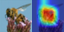
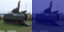
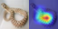
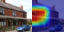

# 🎯 ResNet-18 — CIFAR-100 Classification (From Scratch, 150 Epochs)

This repository contains a complete, end-to-end training pipeline for a **CIFAR-optimized ResNet-18** trained **from scratch** (no pretraining) on **CIFAR-100** for **150 epochs**.

The project demonstrates:

- A clean, minimal PyTorch training pipeline.
- Strong regularization and augmentation for small-image datasets.
- High-performance training on AWS EC2 GPUs.
- Full logging of **150 epochs** (train/test loss + accuracy).
- **Grad-CAM** interpretability visualizations.
- A deployed **HuggingFace Space** for live inference.

The implementation exceeds the assignment goal of *≥73%* top-1 accuracy and achieves:

> **⭐ Final Test Accuracy: 77.00% @ Epoch 150**  

> **🏆 Best Test Accuracy: 77.05% @ Epoch 144**

---

## 📁 Repository Structure

```text
.
├── README.md
├── CIFAR-100_v3.1.ipynb             # Full training notebook
├── training_logs_v2.md              # All 150 epoch logs
├── models/
│   └── best_resnet_cifar100.pth     # Best checkpoint (epoch 144)
├── src/
│   ├── model.py                     # CIFAR-optimized ResNet-18
│   ├── dataset.py                   # Dataloaders + augmentations
│   ├── train.py                     # Script training pipeline
│   └── gradcam_utils.py             # Grad-CAM implementation
└── assets/
    └── gradcam/
        ├── gradcam_sample_0.png
        ├── gradcam_sample_1.png
        └── gradcam_sample_2.png

```
------

## 🧠 Model Architecture (CIFAR-Optimized ResNet-18)

High-level structure

This is a ResNet-18 style network adapted for 32×32 CIFAR images:
	•	No 7×7 conv or max-pooling at the start.
	•	Stem is a 3×3 conv with stride=1.
	•	Four residual stages, each with 2 BasicBlocks.
	•	Downsampling happens at the first block of layer2, layer3, and layer4 via stride=2.
	•	Final head: Global Average Pool (1×1) → Dropout(p=0.3) → FC(512 → 100).

```text
Input (3×32×32)
  ↓
Conv3×3 (3→64, stride 1) + BN + ReLU
  ↓
Layer1: 2 × BasicBlock(64→64, stride 1)
  ↓
Layer2: 2 × BasicBlock(64→128 then 128→128, first block stride 2)
  ↓
Layer3: 2 × BasicBlock(128→256 then 256→256, first block stride 2)
  ↓
Layer4: 2 × BasicBlock(256→512 then 512→512, first block stride 2)
  ↓
AdaptiveAvgPool2d(1×1) → Dropout(0.3) → Linear(512→100)
```


Total params (from your code):
	•	**Total parameters**: 11,220,132
	•	**Trainable parameters**: 11,220,132
	•	**Frozen parameters**: 0

-----

## 🔍 Receptive Field & Dimensions — Block-Level Table

Assumptions:
	•	Input image: **3** × **32** × **32**
	•	All convolutions: kernel=3, padding=1, unless explicitly noted.
	•	Receptive field (RF) is computed at the output of each block, starting with RF=1 at the input pixel.
	•	RF update rule:
		•	`jump_l = jump_(l-1) * stride_l`
		•	`RF_l   = RF_(l-1) + (kernel_l - 1) * jump_(l-1)`

Here’s the block-level summary:

| Stage      | Block    | In_C → Out_C | Kernel / Stride / Pad | Input Dim (HxW) | Output Dim (HxW) | Params (block) | RF at block output |
| ---------- | -------- | ------------ | --------------------- | --------------- | ---------------- | -------------- | ------------------ |
| **Stem**   | conv1    | 3 → 64       | 3×3 / 1 / 1           | 32×32           | 32×32            | 1,856          | 3                  |
| **Layer1** | Block1   | 64 → 64      | (3×3,1,1)×2           | 32×32           | 32×32            | 73,984         | 7                  |
|            | Block2   | 64 → 64      | (3×3,1,1)×2           | 32×32           | 32×32            | 73,984         | 11                 |
| **Layer2** | Block1   | 64 → 128     | conv1: 3×3 /2 /1      | 32×32           | 16×16            | 230,144        | 17                 |
|            |          |              | conv2: 3×3 /1 /1      |                 |                  |                |                    |
|            |          |              | shortcut: 1×1 /2 /0   |                 |                  |                |                    |
|            | Block2   | 128 → 128    | (3×3,1,1)×2           | 16×16           | 16×16            | 295,424        | 25                 |
| **Layer3** | Block1   | 128 → 256    | conv1: 3×3 /2 /1      | 16×16           | 8×8              | 919,040        | 37                 |
|            |          |              | conv2: 3×3 /1 /1      |                 |                  |                |                    |
|            |          |              | shortcut: 1×1 /2 /0   |                 |                  |                |                    |
|            | Block2   | 256 → 256    | (3×3,1,1)×2           | 8×8             | 8×8              | 1,180,672      | 53                 |
| **Layer4** | Block1   | 256 → 512    | conv1: 3×3 /2 /1      | 8×8             | 4×4              | 3,673,088      | 77                 |
|            |          |              | conv2: 3×3 /1 /1      |                 |                  |                |                    |
|            |          |              | shortcut: 1×1 /2 /0   |                 |                  |                |                    |
|            | Block2   | 512 → 512    | (3×3,1,1)×2           | 4×4             | 4×4              | 4,720,640      | **109**            |
| **Head**   | GAP + FC | 512 → 100    | GAP 4×4 → 1×1; FC     | 4×4 → 1×1       | 1×1              | 51,300         | 109                |


-----

## 🧪 Dataset & Augmentations

### Dataset: CIFAR-100
	•	50,000 train, 10,000 test
	•	100 classes, 32×32 RGB

### Normalization:
	•	Mean: **(0.5071, 0.4867, 0.4408)**
	•	Std:  **(0.2675, 0.2565, 0.2761)**

### Training augmentations:
	•	`RandomCrop(32, padding=4)`
	•	`RandomHorizontalFlip(p=0.5)`
	•	`RandomRotation(±15°)`
	•	`ColorJitter (brightness, contrast, saturation, hue)`
	•	`RandomErasing(p=0.5)`
	•	`CutMix with Beta(α=1.0) (applied with some probability)`

These are tuned for long training (150 epochs) so the model keeps seeing varied views and doesn’t just memorize.

-----

## ⚙️ Training Configuration

**Hardware**
	•	AWS **EC2 g5.2xlarge
	•	NVIDIA A10G (24 GB)**
	•	Wall-clock training time: ~45–60 minutes for 150 epochs with AMP

**Optimizer & Loss**
	•	Optimizer: `SGD(lr=0.1, momentum=0.9, weight_decay=5e-4)`
	•	Scheduler: `OneCycleLR over 150 epochs`
	•	Loss: `CrossEntropyLoss(label_smoothing=0.1)`
	•	Precision: `torch.amp.autocast("cuda") + GradScaler("cuda")`

-----

## 📈 Training Progress (`from training_logs_v2.md`)

A small snapshot (exact values from your logs):

| Epoch | Train Loss | Train Acc (%) | Test Loss | Test Acc (%) | Notes                          |
| ----: | ---------: | ------------: | --------: | -----------: | ------------------------------ |
|     1 |     4.3685 |          5.18 |    3.9975 |        10.94 | Initial convergence            |
|    25 |     2.6839 |         46.40 |    2.2202 |        54.12 | Strong feature learning        |
|    50 |     2.2324 |         59.39 |    1.8846 |        65.02 | Solid mid-training performance |
|    75 |     2.2250 |         60.85 |    1.8608 |        67.15 | Good generalization            |
|   100 |     1.9964 |         69.05 |    1.7489 |        69.70 | Near target (≥73%)             |
|   125 |     1.6978 |         78.22 |    1.6642 |        73.28 | Crosses assignment target      |
|   140 |     1.5568 |         82.37 |    1.5493 |        76.45 | Very strong performance        |
|   144 |     1.5960 |         81.17 |    1.5465 |    **77.05** | **Best test accuracy**         |
|   150 |     1.6258 |         82.02 |    1.5485 |    **77.00** | Final model                    |


Full logs (all 150 epochs) are in:
	•	[`training_logs_v2.md`](https://github.com/SXD390/ERA_CIFAR_100_ResNET_18/blob/main/training_logs_v2.md)

-----

## 🔥 Grad-CAM Visualizations

Grad-CAM is computed using the last conv in the last block:
```py
target_layer = model.layer4[1].conv2  # or layer4[-1].conv2
```
For an input image:`
	**1.**	Forward pass → logits.
	**2.**	Pick predicted class (or any target class).
	**3.**	Backprop from that scalar logit.
	**4.**	Compute channel-wise weights via global average pooling of gradients.
	**5.**	Weighted sum of activations → ReLU → normalize → upsample.
	**6.**	Overlay on the original image.

Example outputs:

<p float="left">
  
  
  
    
	
	
	
	
</p>


These show the network focusing on semantically meaningful regions of the object.

----

### 🤗 HuggingFace Space

A live demo is deployed on HuggingFace Spaces (Gradio):
	•	URL: `https://huggingface.co/spaces/<your-username>/<your-space-name>`

Features:
	•	Upload any image.
	•	Resizes and normalizes using CIFAR-100 stats.
	•	Runs it through `best_resnet_cifar100.pth.`
	•	Returns top-5 predictions with probabilities.

----

## 🛠 Running Locally

Install dependencies
```py
pip3 install -r requirements.txt
```
### Option 1: Re-run training
```py
python src/train.py \
  --data-dir ./data \
  --batch-size 512 \
  --epochs 150 \
  --lr 0.1 \
  --weight-decay 5e-4 \
  --num-workers 4
```
### Option 2: Use the notebook
```bash
jupyter notebook CIFAR-100_v3.1.ipynb
```
Run all cells to:
	•	Download CIFAR-100.
	•	Build the model.
	•	Train (optional).
	•	Load the best checkpoint.
	•	Generate Grad-CAM visualizations.

----

✅ Summary
	•	**Architecture**: CIFAR-optimized ResNet-18 with detailed RF and param analysis.
	•	**Training**: 150 epochs from scratch on CIFAR-100.
	•	**Hardware**: EC2 g5.2xlarge (A10G GPU).
	•	**Best Test Accuracy**: 77.05% @ epoch 144.
	•	**Final Test Accuracy**: 77.00% @ epoch 150.
	•	**Regularization**: CutMix, Random Erasing, Label Smoothing, Dropout.
	•	**Interpretability**: Grad-CAM integrated.
	•	**Deployment**: Live HuggingFace Space.
